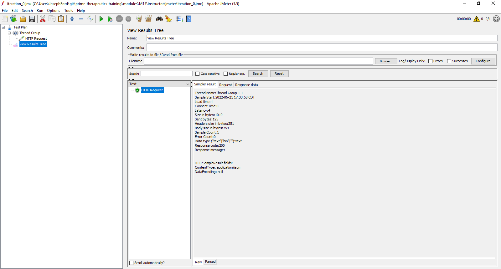

# Exercise - Performance Test Field Agent API

## Exercise Overview

For this exercise, you will execute performance tests against the Field Agent API. The Test Plan has already been completed. The operations and business teams would like you to execute performance testing to determine baseline performance for the following:

High Level Plan
  - Add New Agent
    - POST http://localhost:8080/api/agent
  - Get 1 Agent which results in 200
    - GET http://localhost:8080/api/agent/n
  - Delete Agent
    - DELETE http://localhost:8080/api/agent/n
  - Get 1 Agent which results in 404
    - GET http://localhost:8080/api/agent/n

Test Metrics to Gather
  - Response Time

## Create Performance Test Script

Create a new JMeter Test Plan, a Thread Group, an HTTP Request, and a View Results Tree. Save it in your assessment folder.

```
Test Plan
├───Thread Group
│   └───HTTP Request
└───View Results Tree
```

HTTP Request:
- Server: `localhost`
- Post: `8080`
- Path: `/api/agent`


Leave everything else default, and click Start. Navigate to the View Results Tree and inspect what happened. Talk about what happened with with a peer or your group.



Navigate to "Thread Group" and change "Number of Threads (users)" and "Loop Count" to 2. 


Click "Clear All" and then Start, and then navigate to the View Results Tree and inspect/discuss what happened. 


Investigate the other options on the Thread Group component. Change Thread Group back to the defaults before proceeding.

## Implement High Level Test Plan

Next let's implement our Test Plan at a high-level. 
  - Add New Agent
    - POST http://localhost:8080/api/agent
  - Get 1 Agent which results in 200
    - GET http://localhost:8080/api/agent/n
  - Delete Agent
    - DELETE http://localhost:8080/api/agent/n
  - Get 1 Agent which results in 404
    - GET http://localhost:8080/api/agent/n

`HTTP Request Defaults` can be used so that `server name`, `port number`, `content encoding` don't need to be specified in each `HTTP Request`. Add a new `HTTP Request` for each action in our test plan.

```
Test Plan
├───Thread Group
│   ├───*HTTP Request Defaults*
│   ├───*HTTP Request (Add New Agent)*
│   ├───*HTTP Request (Get Agent (200))*
│   ├───*HTTP Request (Delete Agent)*
│   └───*HTTP Request (Get Agent (404))*
└───View Results Tree
```

HTTP Request Defaults
  - Server Name: `localhost`
  - Port Number: `8080`
  - Content encoding: `UTF-8`

HTTP Request (Add New Agent)

  - Name: `HTTP Request (Add New Agent)`
  - HTTP Request: `POST`
  - Path: `/api/agent`
  - Body Data: `{"firstName": "Fred","middleName": "McFeely","lastName": "Rogers","dob": "1928-03-20","heightInInches": 72}` (additional new lines and white space are okay)

HTTP Request (Get Agent (200))

  - Name: `HTTP Request (Get Agent (200))`
  - HTTP Request: `GET`
  - Path: `/api/agent/${agentId}`
  - The "${agentId}" is a parameter.

HTTP Request (Delete Agent)

  - Name: `HTTP Request (Delete Agent)`
  - HTTP Request: `DELETE`
  - Path: `/api/agent/${agentId}`
  - The "${agentId}" is a parameter.

HTTP Request (Get Agent (404))

  - Name: `HTTP Request (Get Agent (404))`
  - HTTP Request: `GET`
  - Path: `/api/agent/${agentId}`
  - The "${agentId}" is a parameter.

Save it. Click Clear, and then Click Play. Look at the View Results Tree. What happened?

HTTP Request (Add New Agent)
  - Failed because missing Content Type on POST.
  - We can use `HTTP Header Manager` to add custom headers to any HTTP request

HTTP Request (Get Agent (200)) & HTTP Request (Delete Agent) & HTTP Request (Get Agent (404))
  - Failed because http://localhost:8080/api/agent/${agentId} is not a valid URL.
  - We can use `JSON Extractor` to extract the `agentId` from the POST response and set as a new parameter

## Add `HTTP Header Manager` and `JSON Extractor`

```
Test Plan
├───Thread Group
│   ├───HTTP Request Defaults
│   ├───HTTP Request (Add New Agent)
│   |   ├───*HTTP Header Manager*
│   |   └───*JSON Extractor*
│   ├───HTTP Request (Get Agent (200))
│   ├───HTTP Request (Delete Agent)
│   └───HTTP Request (Get Agent (404))
└───View Results Tree
```

HTTP Header Manager
  - Click "Add" button
  - Name: `content-type`
  - Value: `application/json`

JSON Extractor
  - Names of created variables: `agentId`
  - JSON Path expressions: `$.agentId`

Save it. Click Clear, and then Click Play. Look at the View Results Tree. What happened?


JMeter considers non-2xx responses "errors". We expect a 404 in this instance, and we would not consider it an error. 

## Ignore expected 404 errors

Instruct JMeter to ignore this error with a `Response Assertion`.

```
Test Plan
├───Thread Group
│   ├───HTTP Request Defaults
│   ├───HTTP Request (Add New Agent)
│   |   ├───HTTP Header Manager
│   |   └───JSON Extractor
│   ├───HTTP Request (Get Agent (200))
│   ├───HTTP Request (Delete Agent)
│   └───HTTP Request (Get Agent (404))
│       └───*Response Assertion*
└───View Results Tree
```

Response Assertion
  - Radio Button: `Response Code`
  - Checkbox: `Ignore Status`
  - Pattern Matching Rules: `Equals`
  - Patterns to Test: `404`

Save it. Click Clear, and then Click Play. Look at the View Results Tree. The test should now pass.


## Extract Test Data to CSV

Now let's use an external data file to drive variations in our test. Create a file `data_file.csv` in the exact same folder as your Test Plan (should be the assessment folder).

```
firstName,middleName,lastName,dob,heightInInches
Tester,Mc,TestyFace,1979-01-01,66
Brighton,E,Early,1985-01-01,70
Brock,E,Lee,1999-01-01,72
Ferris,M,Wheeler,1945-01-01,73
```

Add `CSV Data Set Config` to `Thread Group`. Edit `HTTP Request (Add New Agent)` to use parameters. Add `JSON Assertion` for each data element in `HTTP Request (Get Agent (200))`

```
Test Plan
├───Thread Group
│   ├───*CSV Data Set Config*
│   ├───HTTP Request Defaults
│   ├───*HTTP Request (Add New Agent)*
│   |   ├───HTTP Header Manager
│   |   └───JSON Extractor
│   ├───HTTP Request (Get Agent (200))
│   |   ├───*JSON Assertion (firstName)*
│   |   ├───*JSON Assertion (middleName)*
│   |   ├───*JSON Assertion (lastName)*
│   |   ├───*JSON Assertion (dob)*
│   |   └───*JSON Assertion (heightInInches)*
│   ├───HTTP Request (Delete Agent)
│   └───HTTP Request (Get Agent (404))
│       └───Response Assertion
└───View Results Tree
```

Edit existing: HTTP Request (Add New Agent)
  - Body Data: `{"firstName": "${firstName}","middleName": "${middleName}","lastName": "${lastName}","dob": "${dob}","heightInInches": ${heightInInches}}`

CSV Data Set Config
  - Filename: `data_file.csv`
  - File encoding: `UTF-8`
  - Variable Names (comma-delimited): `firstName,middleName,lastName,dob,heightInInches`
  - Ignore first line: `true`

JSON Assertion (firstName)
  - Name: `JSON Assertion (firstName)`
  - Assert JSON Path exists: `$.firstName`
  - Expected Value: `${firstName}`

JSON Assertion (middleName)
  - Name: `JSON Assertion (middleName)`
  - Assert JSON Path exists: `$.middleName`
  - Expected Value: `${middleName}`

JSON Assertion (lastName)
  - Name: `JSON Assertion (lastName)`
  - Assert JSON Path exists: `$.lastName`
  - Expected Value: `${lastName}`

JSON Assertion (dob)
  - Name: `JSON Assertion (dob)`
  - Assert JSON Path exists: `$.dob`
  - Expected Value: `${dob}`

JSON Assertion (heightInInches)
  - Name: `JSON Assertion (heightInInches)`
  - Assert JSON Path exists: `$.heightInInches`
  - Expected Value: `${heightInInches}`

Save it. Click Clear, and then Click Play. Look at the View Results Tree. If only the first row is getting executed, check the Thread Group settings. Also check the CSV Data Set Config.

## Add Additional Listeners

`Listeners` are reports, graphs and spreadsheets that can be used for analyzing results. In this author's opinion, the built-in graph tools in JMeter are lacking. Export raw results with `Simple Data Writer` and then use Microsoft Excel or [R](https://www.r-project.org/) to analyze the results. 

Add Additional Listeners and run for 1000 iterations.

```
Test Plan
├───*Thread Group*
│   ├───CSV Data Set Config
│   ├───HTTP Request Defaults
│   ├───HTTP Request (Add New Agent)
│   |   ├───HTTP Header Manager
│   |   └───JSON Extractor
│   ├───HTTP Request (Get Agent (200))
│   |   ├───JSON Assertion (firstName)
│   |   ├───JSON Assertion (middleName)
│   |   ├───JSON Assertion (lastName)
│   |   ├───JSON Assertion (dob)
│   |   └───JSON Assertion (heightInInches)
│   ├───HTTP Request (Delete Agent)
│   └───HTTP Request (Get Agent (404))
│       └───Response Assertion
├───View Results Tree
├───*Summary Report*
├───*Aggregate Report*
├───*Graph Results*
└───*Simple Data Writer*
```

Edit existing Thread Group:
  - Number of Threads: 1
  - Ramp-up period (seconds): 1
  - Loop Count: 1000

Summary Report, Aggregate Report, Graph Results
  - Keep the default configuration

Simple Data Writer
  - Filename: `test_results.csv`

Save it. Click Clear, and then Click Play. Look at all reports. Play with Graph Results and see if you can get anything useful to display.

Open the `test_results.csv` file with Excel and try to create graphs in Excel.
