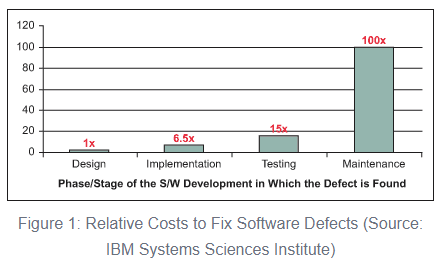

# Introduction to Defects

Defects are deviations from expected behavior. If the product is supposed to be red, but it's blue, that's a defect. If the email address is supposed to be validated for correctness, but there is no validation pop-up to the user when they enter an invalid email address, that is a defect. If the system is supposed to be able to respond within 25ms, but it responds in 35ms, that is a defect. The way defects are discovered are many, but typically occurs during some form of "testing". Worst case, they are discovered by customers!

## Notable Software Defects
"Green Card" Lottery results voided
- [Second green card lottery held after first results voided](https://www.washingtonpost.com/local/second-green-card-lottery-to-be-held-today-after-first-results-voided/2011/07/11/gIQAdX3yFI_story.html)

- [Deputy Assistant Secretary Donahue Says 2012 Diversity Immigrant Visa Process Are Void](https://www.youtube.com/watch?v=E2-WZ8xUtXI)

Knight Capital Group loses $440,000,000 as a result of software defect
- [The Rise and Fall of Knight Capital — Buy High, Sell Low. Rinse and Repeat.](https://medium.com/dataseries/the-rise-and-fall-of-knight-capital-buy-high-sell-low-rinse-and-repeat-ae17fae780f6)

- [Case Study 4: The $440 Million Software Error at Knight Capital](https://www.henricodolfing.com/2019/06/project-failure-case-study-knight-capital.html)

Ariane flight V88 Launch Failure
- [The Worst Computer Bugs in History: The Ariane 5 Disaster](https://www.bugsnag.com/blog/bug-day-ariane-5-disaster)

## Cost of Defects

There are lots of studies and articles that show defects found early in the software development lifecycle cost less than defects found later in the software development lifecycle.
- [Defect Prevention: Reducing Costs and Enhancing Quality](https://www.isixsigma.com/tools-templates/software/defect-prevention-reducing-costs-and-enhancing-quality/)

## Next:
[QA vs QM vs QE](./M15-qa-qm-qe.md)