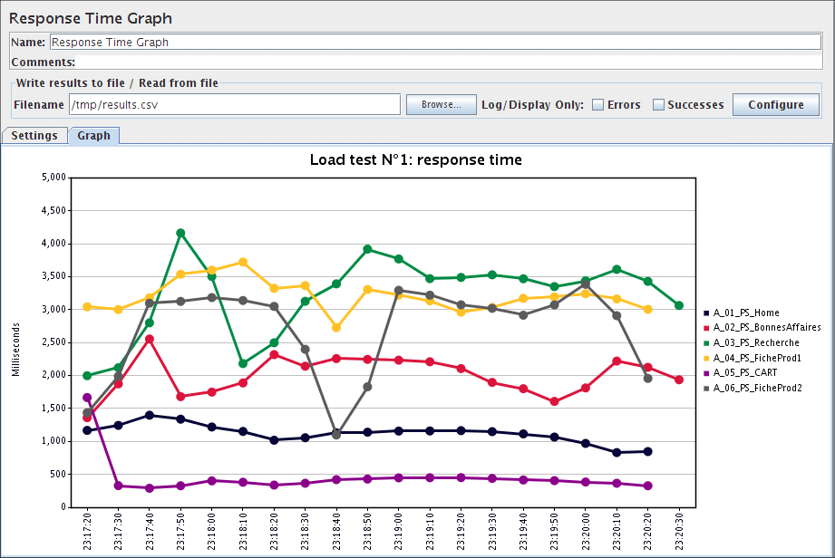

# Introduction to Performance Testing

Performance Testing is an umbrella term to describe all aspects of testing that include an application's ability to respond in a timely manner under all sorts of load scenarios. 

## Learning Outcomes

When you've finished this module you should have a high-level understanding of the following:
  - Performance Testing Process
  - Performance Testing Tools and Technologies
  - Using Apache JMeter to performance test the GET/POST/DELETE endpoints of the Field Agent WebService.

## Performance Testing Process

1. Develop Performance Test Plan
2. Create Performance Test Scripts
3. Implement Application Performance Monitoring
4. Prepare the Test Environment
5. Execute the performance test
6. Analyze the results

### Develop Performance Test Plan

The goals of performance testing very from project to project. It is important to first document the performance testing goals by working with Operations, Engineering Management and the Product Owner and then documenting a Performance Test Plan. Some example goals:
  - Execute load testing to demonstrate the system can handle 200 concurrent users
  - Execute stress testing to determine at what point the system needs to be scaled out
  - Execute spike testing to ensure the system can handle a large spike in traffic when the "sale goes live". 

As part of developing the test plan, you will identify which performance test types will be included. Again, these are just different terms used in Performance Testing, and they are not difficult concepts to understand, and they just help us in communicating with one another.
  - Load Testing
    - Under the expected load, do all users experience acceptable response times?
    - Ramp up to expected level and then hold
  - Stress Testing
    - At what point does the system stop performing as expected when the load is larger than expected?
    - Ramp up slowly beyond expected levels
  - Spike Testing
    - If an unusually large amount of traffic "spikes" can the system handle it? Can the system scale up to handle the traffic? How quickly does the scale up happen and is that short enough? Does it scale back down after the spike is gone?
    - Ramp up quickly beyond expected levels, ramp down quickly, etc.
  - Endurance Testing
    - Similar to load testing, but for a very large amount of time. Some performance bugs only reveal themselves after the application has been "up" for a very large amount of [wall time](https://en.wikipedia.org/wiki/Elapsed_real_time). Other performance bugs reveal themselves only after a certain number of requests have been processed.
    - Ramp up to expected level and then hold for a long time.
  - Scalability Testing
    - Vertical scaling (scale up / scale down) refers to adding more Memory, CPU, Disk to existing infrastructure. You can choose to scale up your physical layers (e.g. data, application, presentation) independently of each other. Vertical scaling is not usually performance tested, but it could be.
    - Horizontal scaling (scale out / scale in) refers to adding additional nodes to handle increased demand. Some software cannot be scaled horizontally and must run on a single node. For those systems which can be scaled horizontally, you can choose to scale out your physical layers independently. Horizontal scalability and the cloud go hand-in-hand. Instead of companies spending large amounts of money for very powerful servers to handle peak customer traffic, companies are switching to using extremely low cost horizontally-scalable solutions. Distributed Data Stores (e.g. NoSQL databases) need to take into account the [CAP Theorem](https://en.wikipedia.org/wiki/CAP_theorem). Scalability Testing measures how a system performs during scale-out and scale-in changes.

### Create Performance Test Scripts

Performance Scripting is the process of creating code which will execute the simulated user load. Similar to Test Automation, this can be started with simple Record and Playback processes. Then you can manually inspect/edit/customize the code generated by the load testing tool. Scripts can be refactored and modularized for re-usability to create different performance testing scenarios. Within the scripts themselves, metrics will be generated and should be tracked:
  - Throughput (requests per second)
  - Latency (time from request until first byte received)
  - Response Time (time from request until last byte received)
  - Error rate (500s, request timed out, connection timeout, etc.)

### Implement Application Performance Monitoring

Performance Monitoring is software which will monitor the physical layers of the system under test. The performance tester should be able to match load ramp-up times with spikes in CPU/disk/memory usage. Some of the metrics that could be gathered include:
  - CPU usage
  - Memory usage
  - Disk IO
  - Network IO
  - Java Garbage Collection (GC) stats

### Prepare the Test Environment
The test environment to be used for performance testing should have been documented in the test plan. It is important that the test environment be of suitable size for the performance test. If you are trying to capture real-world results, it is important to have real-world hardware and real-world data. 
  - It is possible that it has to be pre-loaded with test data for the performance test scripts.

### Execute the performance test
During this phase, the performance test is executed
  - If the performance test is conducted in Production, this test may occur overnight.
  - It is important to stay alert and shut down the tests if something unexpected happens

### Analyze the results
Gather all the metrics and test results. 
  - Create graphs and overall test metrics
  - Share results with the team

## Next
[Performance Testing Tools / Technologies](./MQA-performance-testing-tools.md)
