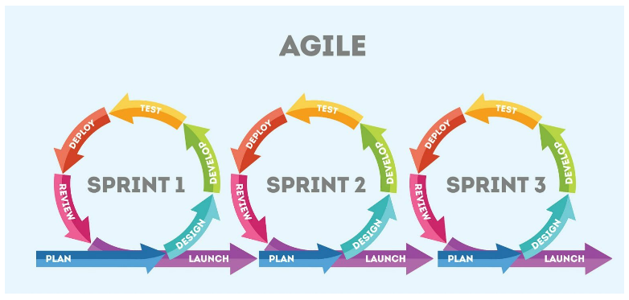

## Software Development Methodologies

Teams don't just sit down and start writing software. They follow a process which includes requirements gathering, coding, testing, deploying, etc. There are two major software development methodologies in use today. [Waterfall](https://en.wikipedia.org/wiki/Waterfall_model) and [Agile](https://en.wikipedia.org/wiki/Agile_software_development).

### Waterfall 

[Waterfall](https://en.wikipedia.org/wiki/Waterfall_model) projects follow a fairly strict, engineering based development model. The model consists of phases, and each phase is worked on in order. You don't proceed to the next phase until the previous phase is complete. The phases include:
- Requirements gathering
  - During this phase, all requirements are documented. All stake-holders/customers previously mentioned have input at this phase. Once requirements are finalized, they will be reviewed by a cross-functional team made up of developers, testers, business analysts, product owners, architects, other development teams, etc.
  - The project proceeds to the next phase once all the requirements have been documented and agreed to by all stake-holders
- Analysis and Design
  - During this phase, the architecture, operations and engineering teams will work on designing a system that will meet all the requirements. It is important to spend sufficient time in this phase so that (poor) early design decisions don't make a large impact later on during the coding / testing or deployment phases.
- Coding
  - During this phase the development team actually works on building the product. While the engineers are working on building the product, the test teams usually begin to write Test Plans and Test Cases
- Testing
  - During this phase the development team "hands it off" to the test team. 
  - The test team spends time executing their test plan and their test cases.
  - If defects are found, the developers will work on fixing the defects and then re-deploying the application for testing by the test team
  - Once all tests pass, or identified defects are "agreed as acceptable" by all stake-holders, then the project can proceed to the next phase 
- Deployment
  - In this phase the software is deployed to the end-users. 
  - Usually the "operations" team handles deploying the product and supporting the system once it is in "production"

Depending on the size of the project, this entire cycle can take from a couple of months to multiple years. Once the application is deployed to production, the cycle starts over again for the next version of the software. "Usually" deployments/upgrades happen between once and a handful of times a year. 

### Agile

Agile projects anticipate the need of the development team to react quickly to changing requirements. They also include more collaboration among the business analysts, developers and testers. Agile projects release early and often. Agile projects work iteratively, where each iteration produces a small incremental change to the product. Agile projects are fantastic for web and mobile applications because deploying the updates to the end user are very easy.

To help understand the [Agile methodology](https://en.wikipedia.org/wiki/Agile_software_development), please take time to read the [Agile manifesto](https://agilemanifesto.org/) to understand why the Agile development model was created and what it is trying to solve. Please take the time to read the [Agile principles](https://agilemanifesto.org/principles.html) as well. There are multiple development models under the Agile umbrella: Extreme Programming (XP), Kanban, Scrum, and Lean. There is no "pure" agile development methodology.

If you want to learn more, there are tons of great articles about Agile. Here are some articles that are great reading material:
- [Scrum vs Waterfall vs Agile vs Lean vs Kanban](https://www.visual-paradigm.com/scrum/scrum-vs-waterfall-vs-agile-vs-lean-vs-kanban/)
- [Agile Software Guide](https://martinfowler.com/agile.html)
- [The New Methodology](https://martinfowler.com/articles/newMethodology.html)

### Waterfall vs. Agile: "Throw it over the fence” vs. “Continuous Quality”

Testing a product that is developed using the Agile methodology has similarities and differences between testing in a Waterfall environment. You still create test cases based on the requirements, but the requirements are usually less well documented and can involve a lot of conversations back-and-forth between the product owners and the testers. Many teams will not consider a product feature complete until there are automated tests written to prove the new feature works as expected. Because of the shorter time frames between development complete and deployment to production, automated testing is an absolute necessity. The amount of repeated regression testing that occurs on an Agile project over the course of a year is substantially higher than in a Waterfall project.

Because a lot of projects are moving towards a more Agile development methodology, and because automated testing is so important for the success of an Agile project, companies are starting to blend the roles of QA and Development. This is the primary focus of QE.

## Next:
[Test Strategies and Levels](./MQA-test-strategies-and-levels.md)