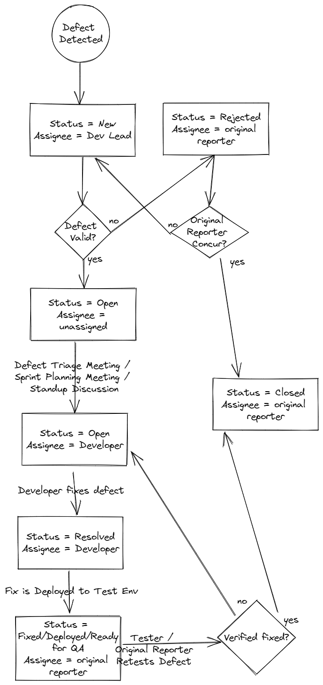

# Lesson: Manual Testing

## Test Plan

Test Plans are high level documents which explain tests that will be performed, roles and responsiblities, dates,high-level test scenarios, etc. They are very important in Waterfall projects. They are not used much anymore in Agile projects.

To see an example, navigate to the below URL and download the Test Plan Sample (about 1/3rd of the way down the page)
- https://www.softwaretestinghelp.com/how-to-write-test-plan-document-software-testing-training-day3/

We will not be creating a Test Plan document as part of this course. They are generally created by Test Leads at the beginning of a Waterfall Project. Some SOX or FDA regulated environments may require Test Plan documents for compliance reasons. 

## Test Case

A Test Case is an ordered list of Test Steps. Usually a Test Case verifies or validates one or more Requirements.  Sometimes multiple Test Cases are required to verify a single Requirement. Sometimes a single Test Case can verify multiple Requirements (or parts of multiple requirements).

Here is an example of a Test Case:

### Test Case 1: Delete a non-existing Solar Farm Panel|
Pre-condition: The database is initialized with 0 solar farm panels

| Step                                                                                  | Expected Result                                                                                              |
|---------------------------------------------------------------------------------------|--------------------------------------------------------------------------------------------------------------|
| 1: Log into Solar Farm Admin UI                                                       | User is successfully logged in                                                                               |
| 2: Select Delete from the Main Menu                                                   | The Delete Menu is displayed. There are text entry fields for Section Name, Row, Column and a Delete button. |
| 3: Enter the following into the delete criteria: Section Name: "XYZ" Row: 1 Column: 1 | The UI allows the data to be entered                                                                         |  
| 4: Click "Delete" button                                                              | Error is displayed "Sorry, XYZ R1 C1 is not a valid Solar Panel"                                             |
| 5: Log out                                                                            | User is successfully logged out.                                                                             |

## Requirement Traceability Matrix

A Requirement Traceability Matrix is like the index at the back of a book. They help you map requirements to Test Cases that verify those requirements. You could have 100 requirements, and each requirement may require many tests in order to satisfy the requirement. For example, each State may have different maximum APRs allowed for a home loan, and you must test each jurisdiction separately. You may also have separate requirements on which states allow flood insurance. Instead of having APR test cases and Flood Insurance Test Cases, we can just have a collection of Test Cases, and each Test Case will verify more than one thing in it.  A traceability matrix will allow an audit to determine which tests were used to verify the various requirements.

You can read more about traceability matrices online:
https://www.softwaretestinghelp.com/requirements-traceability-matrix/

We will not be creating a Requirements Traceability Matrix as part of these exercises. They are usually put together by Test Leads and are especially relevant in Waterfall projects. Agile projects do not typically require Traceability Matrices. 

## Test Suite

A Test Suite is simply a collection of test cases. You can mix and match your collection of test cases into various test suites. You can create a Smoke Test Suite, an End to End Test Suite, a Regression Test Suite, an APR Calculation Test Suite and a Flood Insurance Test Suite.  

As a result of a legacy application existing for a long time, it is possible that there are over 1000 documented Test Cases. And in a future release, you may selectively choose to run various test suites instead of running all tests.  Or perhaps your team  has scheduled weekly deployments of the latest and greatest code to the Staging environment and in that environment you aren't allowed to run certain white box tests and can only run your black box test suite. A Test Suite is simply a grouping of test cases for a given purpose.  

You could create a Smoke Test Suite which includes 10 high-level scenarios that exercises high breadth, but not necessarily depth of your application/system. Or if you have been having a lot of performance issues of late, you may want to execute your Performance Test Suite before going live with that new change. A Test Suite is just a fancy way of saying "this group of tests is good for verifying X" and "this other group of tests is good for verifying Y".         

## Test Run

A Test Run is the execution of a certain version of test cases on a certain version of the code, at a certain date/time, in a certain environment. Suppose for example that you have identified 1000 test cases that you want to execute as part of your regression testing for the release coming up. When the software is initially deployed to the test environment, you are able to get through 250 of those test cases until you encountered a catastrophic bug that prevents you from testing any further. At this point you stop testing and wait for the development team to fix the bug, and deploy the fix to the test environment. Once the code is re-deployed, do you pick up where you left off or do you start fresh?  Did your Test Run end and a new Test Run begins? That kind of depends on the environment you are working in. If you are in an FDA or SOX regulated environment, the previous Test Run is complete, and a new Test Run begins. Some institutions may have compliance reporting requirements that require a complete Test Run is executed entirely without any failing tests before that code is deployed to end users. If any new code deployment happens, the Test Run ends and a new Test Run begins. 

Test Runs are also a way to capture the current state of the test case when the test case was executed.  For example, suppose you have a test case called "Update User Profile" that you execute as part of your regression testing each release. In a future release, the Update User Profile functionality actually changed so that you had to update your test case. The historical Test Runs that contain that test case should NOT get updated when you update the test case. The updated test case should only apply to new test runs.  If a compliance audit is performed, the exact steps that were taken when the test case was executed needs to be identified, not the current version of the test case.

## Defects

Defects (AKA Defect Reports, Bugs, Bug Reports) are opened whenever a test case fails or when ad-hoc testing is performed and a undesirable or questionable application behaviour is observed. Usually teams allow anyone to open a defect, but it is typically Testers, Developers, and Business Analysts/System Analysts that open defects. Defect Tracking tools are almost always used, and most of the time these defect tracking tools are tightly integrated with the other project tracking tools used, such as requirement documentation, task or "story" cards, etc.

Here is what a basic defect looks like:

```
Title/Summary 
User Configuration System Menu option missing when searching from System Menu 

Description
Was unable to find the User Configuration System option when searching for "User Configuration"
This regression was introduced in 56.7.2 and was successfully working in 56.7.1

Steps to Reproduce
- Login as User
- Go to the System menu.
- Search for "User Configuration"

Expected Result
User Configuration System Menu option is displayed.

Actual Result
User Configuration System Menu option is not displayed.

Work-around
The user can click on the hamburger menu option and find the User Configuration System option there and it works as expected. 

Screenshot attached.
```

Usually meta-data about the defect is also captured, and can include for example:
- Environment Found
  - Test
  - Stage
  - Prod
- Date Found
- Date Fixed/Closed
- Code Version
- Linked Test Case / Test Run
- Root Cause
  - Requirement
  - Coding issue
  - Environment issue
  - Data issue
- Severity (Most companies have custom priority/severity guidelines to follow)
  - Critical
  - Major
  - Moderate
  - Minor
- Priority
  - High
  - Medium
  - Low

Defects follow a company or team-defined defect tracking flow. Usually something like this:



Some Teams opt to not allow any code to be released when there are known defects. Other teams, depending on the severity of the defect, will allow the code to be released despite known defects. Some teams hold periodic defect tracking meetings where some or all of the known existing defects will be discussed and either slotted for fixing in a future release, marked as "Closed Won't Fix" for various reasons, etc. Usually the Test Lead or QA Analyst on the team holds these meetings and invites key members of the team, including engineering leads, product / business owners, and project managers. 

## Exercises

Complete the following exercises
- [Manual Test Cases](../exercises/M11-exercise-manual-test-cases.md)
- [Defects](../exercises/M11-exercise-defects.md)
