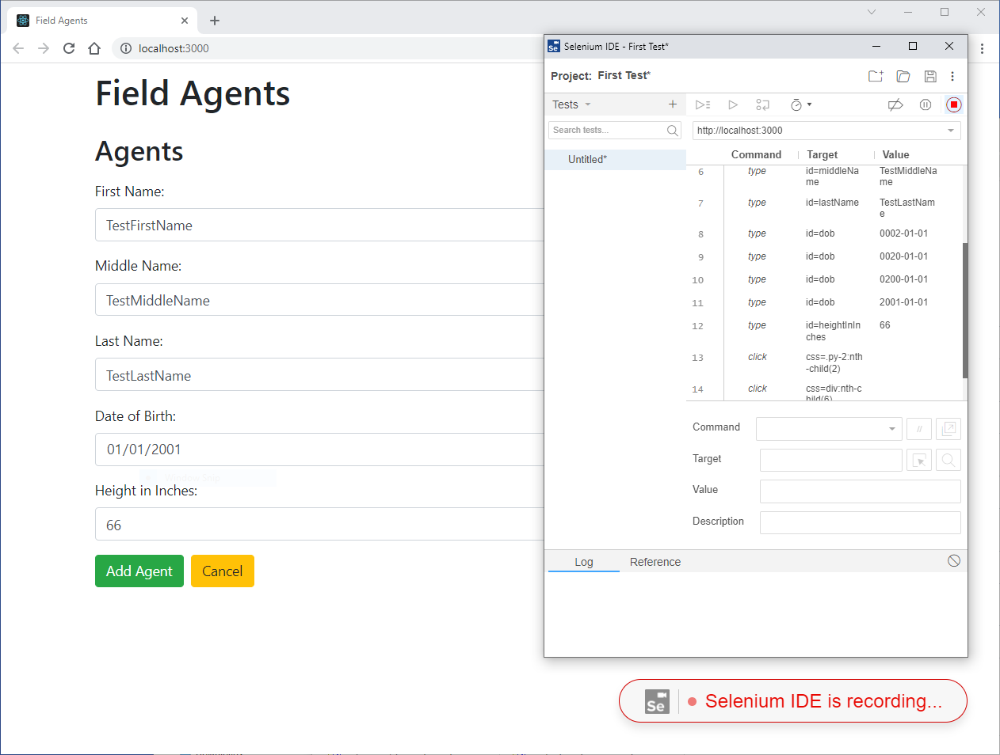
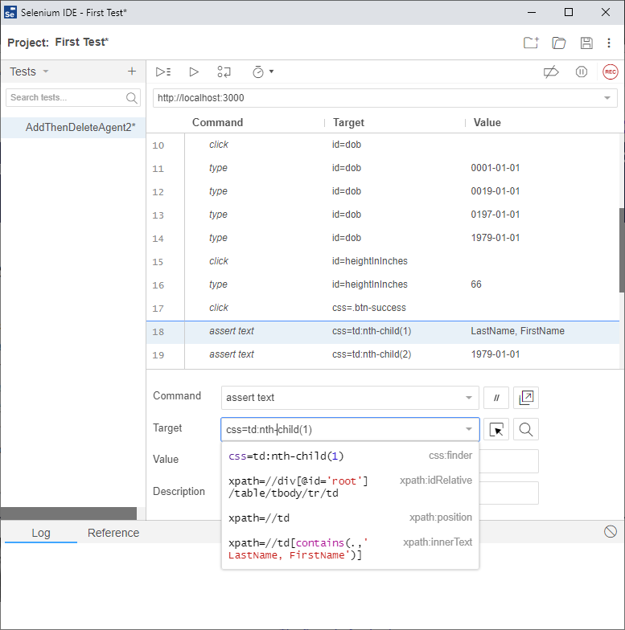

# Part 2: Record and Playback
1. If you haven't already, follow the steps in [M15-exercise-manual-testing.md](./M15-exercise-manual-testing.md) to "Prepare the test environment"
2. Open Chrome, then open the Selenium IDE extension


3. Give the project any name, and set the base URL to http://localhost:3000 and click Start Recording.
4. A new browser window should open and Field Agents should be displayed. 
5. Add a new agent
 - When adding an agent, make sure to exercise each field, even optional ones, so that Selenium IDE captures information about those fields. 
6. After adding the agent, 
 - Right click on the new agent's name and select Selenium IDE -> Assert -> Text. 
 - Right click on the new agent's DOB and select Selenium IDE -> Assert -> Text.
7. Click the Delete button
8. In the confirmation dialog, "Assert" all of the data. (Right Click, Assert Text)
9. Confirm the delete



7. Click the stop button in Selenium IDE and give the test any name
8. Right Click on the test name and select Export. Choose Java / JUnit and leave all the other options default. Save it anywhere on your computer. Don't close the Selenium IDE or new Browser Window it opened quite yet.
9. Create a new blank Java Maven project in IntelliJ in M15/assessment/field-agent-tests
10. Add the following dependencies in your pom.xml and rebuild the project. 

```
    <dependencies>

        <dependency>
            <groupId>org.junit.jupiter</groupId>
            <artifactId>junit-jupiter-api</artifactId>
            <version>5.8.2</version>
            <scope>test</scope>
        </dependency>

        <dependency>
            <groupId>org.seleniumhq.selenium</groupId>
            <artifactId>selenium-java</artifactId>
            <version>4.2.2</version>
        </dependency>

        <dependency>
            <groupId>org.hamcrest</groupId>
            <artifactId>hamcrest</artifactId>
            <version>2.2</version>
            <scope>test</scope>
        </dependency>

    </dependencies>
```

11. Copy the Record and Playback file from Selenium IDE to the "learn" package in the test source folder.

```
    └───field-agent-tests
        └───src
            ├───main
            │   ├───java
            │   │   └───learn
            │   └───resources
            └───test
                ├───java
                |   └───learn          <--- here 
                └───resources

```

```
// Generated by Selenium IDE
import org.junit.Test;
import org.junit.Before;
import org.junit.After;
import static org.junit.Assert.*;
import static org.hamcrest.CoreMatchers.is;
import static org.hamcrest.core.IsNot.not;
import org.openqa.selenium.By;
import org.openqa.selenium.WebDriver;
import org.openqa.selenium.firefox.FirefoxDriver;
import org.openqa.selenium.chrome.ChromeDriver;
import org.openqa.selenium.remote.RemoteWebDriver;
import org.openqa.selenium.remote.DesiredCapabilities;
import org.openqa.selenium.Dimension;
import org.openqa.selenium.WebElement;
import org.openqa.selenium.interactions.Actions;
import org.openqa.selenium.support.ui.ExpectedConditions;
import org.openqa.selenium.support.ui.WebDriverWait;
import org.openqa.selenium.JavascriptExecutor;
import org.openqa.selenium.Alert;
import org.openqa.selenium.Keys;
import java.util.*;
import java.net.MalformedURLException;
import java.net.URL;
public class AddThenDeleteAgentTest {
  private WebDriver driver;
  private Map<String, Object> vars;
  JavascriptExecutor js;
  @Before
  public void setUp() {
    driver = new ChromeDriver();
    js = (JavascriptExecutor) driver;
    vars = new HashMap<String, Object>();
  }
  @After
  public void tearDown() {
    driver.quit();
  }
  @Test
  public void addThenDeleteAgent() {
    driver.get("http://localhost:3000/");
    driver.manage().window().setSize(new Dimension(1364, 845));
    driver.findElement(By.cssSelector(".btn")).click();
    driver.findElement(By.id("firstName")).click();
    driver.findElement(By.id("firstName")).click();
    driver.findElement(By.id("firstName")).sendKeys("FirstName");
    driver.findElement(By.id("middleName")).click();
    driver.findElement(By.id("middleName")).sendKeys("MiddleName");
    driver.findElement(By.id("lastName")).click();
    driver.findElement(By.id("lastName")).sendKeys("LastName");
    driver.findElement(By.id("dob")).click();
    driver.findElement(By.id("dob")).sendKeys("2022-01-11");
    driver.findElement(By.id("dob")).click();
    driver.findElement(By.id("dob")).sendKeys("0001-01-11");
    driver.findElement(By.id("dob")).sendKeys("0019-01-11");
    driver.findElement(By.id("dob")).sendKeys("0197-01-11");
    driver.findElement(By.id("dob")).sendKeys("1979-01-11");
    driver.findElement(By.id("heightInInches")).click();
    {
      WebElement element = driver.findElement(By.cssSelector("html"));
      Actions builder = new Actions(driver);
      builder.moveToElement(element).clickAndHold().perform();
    }
    {
      WebElement element = driver.findElement(By.cssSelector("html"));
      Actions builder = new Actions(driver);
      builder.moveToElement(element).perform();
    }
    {
      WebElement element = driver.findElement(By.cssSelector("html"));
      Actions builder = new Actions(driver);
      builder.moveToElement(element).release().perform();
    }
    driver.findElement(By.cssSelector("html")).click();
    driver.findElement(By.id("heightInInches")).sendKeys("66");
    driver.findElement(By.cssSelector(".btn-success")).click();
    assertThat(driver.findElement(By.cssSelector("td:nth-child(1)")).getText(), is("LastName, FirstName"));
    driver.findElement(By.cssSelector("td:nth-child(2)")).click();
    assertThat(driver.findElement(By.cssSelector("td:nth-child(2)")).getText(), is("1979-01-11"));
    driver.findElement(By.cssSelector(".btn-danger")).click();
    assertThat(driver.findElement(By.cssSelector("li:nth-child(1)")).getText(), is("First Name: FirstName"));
    driver.findElement(By.cssSelector("li:nth-child(2)")).click();
    assertThat(driver.findElement(By.cssSelector("li:nth-child(2)")).getText(), is("Middle Name: MiddleName"));
    driver.findElement(By.cssSelector("li:nth-child(3)")).click();
    driver.findElement(By.cssSelector("li:nth-child(3)")).click();
    assertThat(driver.findElement(By.cssSelector("li:nth-child(3)")).getText(), is("Last Name: LastName"));
    assertThat(driver.findElement(By.cssSelector("li:nth-child(4)")).getText(), is("Date of Birth: 1979-01-11"));
    driver.findElement(By.cssSelector("li:nth-child(5)")).click();
    assertThat(driver.findElement(By.cssSelector("li:nth-child(5)")).getText(), is("Height in Inches: 66"));
    driver.findElement(By.cssSelector(".btn-danger")).click();
    driver.findElement(By.cssSelector("html")).click();
    driver.findElement(By.cssSelector("html")).click();
  }
}
```

12. The Test Case is written in JUNit 4, but we're using JUnit 5. Convert the test to JUnit 5:
 - change @Before and @After to @BeforeEach and @AfterEach

Here are my imports in case they are helpful for you:
```
import org.junit.jupiter.api.AfterEach;
import org.junit.jupiter.api.BeforeEach;
import org.junit.jupiter.api.Test;
import org.openqa.selenium.By;
import org.openqa.selenium.Dimension;
import org.openqa.selenium.JavascriptExecutor;
import org.openqa.selenium.WebDriver;
import org.openqa.selenium.WebElement;
import org.openqa.selenium.chrome.ChromeDriver;
import org.openqa.selenium.interactions.Actions;

import java.util.HashMap;
import java.util.Map;

import static org.hamcrest.CoreMatchers.is;
import static org.hamcrest.MatcherAssert.assertThat;
```

13. Cleanup

Your test probably does not look identical. Why? Because Selenium IDE records everything that the user does and tries it's best to interpret that into actions that can be played back. If you clicked on fields differently than I did, your results will vary. For example, if you look for "firstName" above, you will see I clicked twice into the field. Clicking the fields isn't even necessary. I'm going to remove all unnecessary clicks.

```
    driver.findElement(By.cssSelector(".btn-success")).click();
-    driver.findElement(By.id("firstName")).click();
    driver.findElement(By.id("firstName")).sendKeys("FirstName");
```

If you look at the "dob" above, you will see Selenium IDE didn't do the best job. I used the calendar pop-up and you can see when I did that Selenium IDE recorded each click as a "Send Keys" action. Because the user can type "01011979" into the dob field on the UI, change the dob code to the following.

```
    driver.findElement(By.id("lastName")).sendKeys("LastName");
-    driver.findElement(By.id("dob")).sendKeys("2022-01-11");
-    driver.findElement(By.id("dob")).sendKeys("0001-01-11");
-    driver.findElement(By.id("dob")).sendKeys("0019-01-11");
-    driver.findElement(By.id("dob")).sendKeys("0197-01-11");
-    driver.findElement(By.id("dob")).sendKeys("1979-01-11");
+    driver.findElement(By.id("dob")).sendKeys("01111979");
    driver.findElement(By.id("heightInInches")).click();
```

14. Run the test.
 - What went wrong? 

 ```
java.lang.IllegalStateException: The path to the driver executable The path to the driver executable must be set by the webdriver.chrome.driver system property; for more information, see https://github.com/SeleniumHQ/selenium/wiki/ChromeDriver. The latest version can be downloaded from https://chromedriver.storage.googleapis.com/index.html
```
 
 The Test can't find Selenium WebDriver. Selenium WebDriver is the executable that allows our Java code to talk to our browser. Instead of downloading the driver manually, let's let WebDriverMananger do it for us.

15. Add to your pom.xml:

```
        <dependency>
            <groupId>io.github.bonigarcia</groupId>
            <artifactId>webdrivermanager</artifactId>
            <version>5.2.0</version>
        </dependency>
```

17. Add to your test class:
```
import io.github.bonigarcia.wdm.WebDriverManager;
import org.junit.jupiter.api.BeforeAll;

<snip>

  @BeforeAll
  static void beforeAll() {
    WebDriverManager.chromedriver().setup();
  }
```

18. Re-run and Continue Debugging

You may have to make additional changes in order to get your test to run successfully. Don't fret! This is one of the biggest challenges in Software Test Automation. Here's a nice article that can help you with object identification: [Locators in Selenium: A Detailed Guide
](https://www.browserstack.com/guide/locators-in-selenium).

Try setting debug points where the test is failing. See if you can figure out why it failed and how you can fix it. Look at the By.xxx expressions that are identifying elements. Sometimes it helps to switch to a different identification method. There are many available. For particularly difficult elements, go back to Selenium IDE. It actually recorded multiple ways to identify an element, but it only exported one of them. Try one of the other ones available.



Inspect the code that was recorded by your script. You can try to clean up the code that was recorded by Selenium IDE to the minimum necessary to accomplish the test case. You will notice that Selenium IDE records every click, whether that click is necessary for your test case or not.

It is possible that you will have to add waits to your code so that Java/Selenium will slow down to allow your browser/server to do their work. You can do that in lots of smart dynamic ways. For now, you can add a `Thread.sleep(100);` to your code if necessary.

Before moving to the next section, please ensure your test cases Adds and Deletes an agent and also verifies text on the main screen and on the delete confirmation screen.  If you get stuck, you can copy/paste this solution so that you can continue with the rest of the lesson.

```
import io.github.bonigarcia.wdm.WebDriverManager;
import org.junit.jupiter.api.AfterEach;
import org.junit.jupiter.api.BeforeAll;
import org.junit.jupiter.api.BeforeEach;
import org.junit.jupiter.api.Test;
import org.openqa.selenium.By;
import org.openqa.selenium.Dimension;
import org.openqa.selenium.JavascriptExecutor;
import org.openqa.selenium.WebDriver;
import org.openqa.selenium.chrome.ChromeDriver;

import java.util.HashMap;
import java.util.Map;

import static org.junit.jupiter.api.Assertions.assertEquals;

public class AddThenDeleteAgentTest {
  private WebDriver driver;
  private Map<String, Object> vars;
  JavascriptExecutor js;

  @BeforeAll
  static void beforeAll() {
    WebDriverManager.chromedriver().setup();
  }

  @BeforeEach
  public void setUp() {
    driver = new ChromeDriver();
    js = (JavascriptExecutor) driver;
    vars = new HashMap<String, Object>();
  }

  @AfterEach
  public void tearDown() {
    driver.quit();
  }

  @Test
  public void addThenDeleteAgent() throws Exception {
    driver.get("http://localhost:3000/");
    driver.manage().window().setSize(new Dimension(1364, 845));
    driver.findElement(By.cssSelector(".btn")).click();
    driver.findElement(By.id("firstName")).sendKeys("FirstName");
    driver.findElement(By.id("middleName")).sendKeys("MiddleName");
    driver.findElement(By.id("lastName")).sendKeys("LastName");
    driver.findElement(By.id("dob")).sendKeys("01011979");
    driver.findElement(By.id("heightInInches")).sendKeys("66");
    driver.findElement(By.cssSelector(".btn-success")).click();
    Thread.sleep(100);
    assertEquals("LastName, FirstName", driver.findElement(By.xpath("//tr[@id=\"row-0\"]/td[@name=\"name\"]")).getText());
    assertEquals("1979-01-01", driver.findElement(By.xpath("//tr[@id='row-0']/td[@name='dob']")).getText());
    driver.findElement(By.cssSelector(".btn-danger")).click();
    assertEquals("First Name: FirstName", driver.findElement(By.cssSelector("li:nth-child(1)")).getText());
    assertEquals("Middle Name: MiddleName", driver.findElement(By.cssSelector("li:nth-child(2)")).getText());
    assertEquals("Last Name: LastName", driver.findElement(By.cssSelector("li:nth-child(3)")).getText());
    assertEquals("Date of Birth: 1979-01-01", driver.findElement(By.cssSelector("li:nth-child(4)")).getText());
    assertEquals("Height in Inches: 66", driver.findElement(By.cssSelector("li:nth-child(5)")).getText());
    driver.findElement(By.cssSelector(".btn-danger")).click();
  }
}
```
