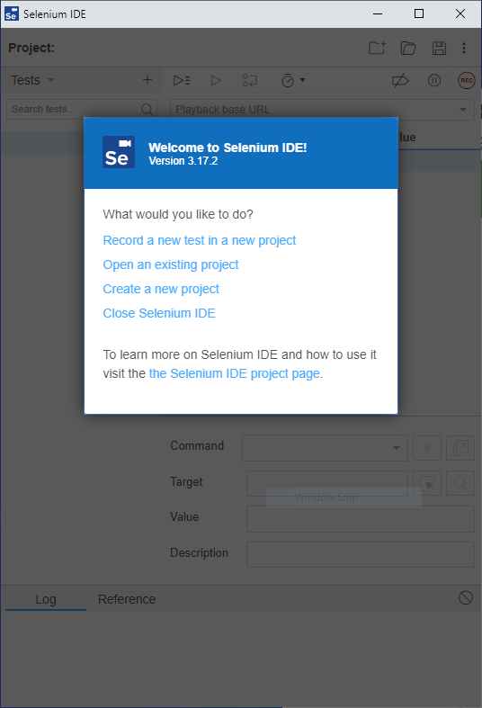
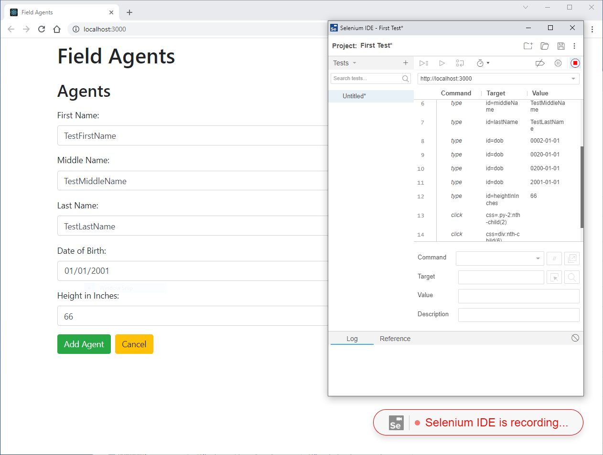

Automate 10 Test Cases with no modularity, no code reuse (record and playback) 
Extract common functionality for code reuse (keyword driven) 
Allow test cases to exhibit different behavior by driving the test flow through the test data (data driven)

## Introduction

In this exercise, we will build on the last exercise by automating (some of) the existing test cases.
- Identify test cases for automation
- Record and Playback one of the test cases using Selenium IDE
- Convert the test case into Keyword Driven format by extracting out common functionality into Java methods
- Extract test data and expected results to an external data file

## Learning Outcomes

When you've finished this exercise you should be able to write basic browser-based software test automation.

## Installation
- Selenium IDE
  - Selenium IDE is a browser extension for Chrome and Firefox. Follow the [installation instructions](https://www.selenium.dev/selenium-ide/). (This guide will be using Chrome)
- Selenium Client and WebDriver Language Bindings
  - These are libraries (JARs) which provide the API for Selenium for Java, C#, Ruby, etc.. You can read the [JavaDocs](https://www.selenium.dev/selenium/docs/api/java/overview-summary.html). We will be installing this using Maven. Alternatively you can download the libraries directly from [Selenium Downloads](https://www.selenium.dev/downloads/).
- Selenium WebDriver
  - Selenium WebDriver is an executable that allows your Java code to open Chrome or Firefox and automate browser activity. We will be installing this using Maven. Alternatively you can download the executable directly from [Selenium Downloads](https://www.selenium.dev/downloads/).

## Record and Playback
1. If you haven't already, follow the steps in [M15-exercise-manual-testing.md](./M15-exercise-manual-testing.md) to "Prepare the test environment"
2. Open Chrome, then open the Selenium IDE extension



1. Give the project any name, and set the base URL to http://localhost:3000 and click Start Recording.
1. A new browser window should open and Field Agents should be displayed. 
1. Add a new agent
 - When adding an agent, make sure to exercise each field, even optional ones, so that Selenium IDE captures information about those fields. 
1. After adding the agent, 
 - Right click on the new agent's name and select Selenium IDE -> Assert -> Text. 
 - Right click on the new agent's DOB and select Selenium IDE -> Assert -> Text.



1. Click the stop button in Selenium IDE and give the test any name
1. Right Click on the test name and select Export. Choose Java / JUnit and leave all the other options default. Save it anywhere on your computer. 
1. Create a new blank Java Maven project in IntelliJ in M15/assessment/field-agent-tests
1. Add the following dependencies in your pom.xml and rebuild the project. 

```
    <dependencies>

        <dependency>
            <groupId>org.junit.jupiter</groupId>
            <artifactId>junit-jupiter-api</artifactId>
            <version>5.8.2</version>
            <scope>test</scope>
        </dependency>

        <dependency>
            <groupId>org.seleniumhq.selenium</groupId>
            <artifactId>selenium-java</artifactId>
            <version>4.2.2</version>
        </dependency>

    </dependencies>
```

1. Copy the Record and Playback file from Selenium IDE into the src/test/java folder. (You may place it in a package as well if desired).
1. The Test Case is written in JUNit 4, but we're using JUnit 5. Convert the test to JUnit 5:
 - change any assertThat's into assertTrue
 - change @Before and @After to @BeforeEach and @AfterEach
 - replace all imports with the following:

 ```
import org.junit.jupiter.api.AfterEach;
import org.junit.jupiter.api.BeforeEach;
import org.junit.jupiter.api.Test;
import org.openqa.selenium.By;
import org.openqa.selenium.Dimension;
import org.openqa.selenium.JavascriptExecutor;
import org.openqa.selenium.WebDriver;
import org.openqa.selenium.WebElement;
import org.openqa.selenium.chrome.ChromeDriver;
import org.openqa.selenium.interactions.Actions;

import java.util.HashMap;
import java.util.Map;

import static org.junit.jupiter.api.Assertions.assertEquals;
```

1. Run the test.
 - What went wrong? The Test can't find Selenium WebDriver. Selenium WebDriver is the executable that allows our Java code to talk to our browser. Instead of downloading the driver manually, let's let WebDriverMananger do it for us.

```
java.lang.IllegalStateException: The path to the driver executable The path to the driver executable must be set by the webdriver.chrome.driver system property; for more information, see https://github.com/SeleniumHQ/selenium/wiki/ChromeDriver. The latest version can be downloaded from https://chromedriver.storage.googleapis.com/index.html
```

1. Add to your pom.xml:

```
        <dependency>
            <groupId>io.github.bonigarcia</groupId>
            <artifactId>webdrivermanager</artifactId>
            <version>5.2.0</version>
        </dependency>
```

1. Add to your imports:

```
import io.github.bonigarcia.wdm.WebDriverManager;
import org.junit.jupiter.api.BeforeAll;
```

1. Add to your test class:
```
  @BeforeAll
  static void beforeAll() {
    WebDriverManager.chromedriver().setup();
  }
```

1. Run the test again. It should pass. If it does not pass, try re-recording it. Look at the XPath expressions that are identifying elements. Inspect the code that was recorded by your script. You can try to clean up the code that was recorded by Selenium IDE to the minimum necessary to accomplish the test case. You will notice that Selenium IDE records every click, whether that click is necessary for your test case or not.

## Summary

Lorem ipsum

* https://www.guru99.com/automated-testing-tools.html
* https://www.google.com/search?q=software+test+automation