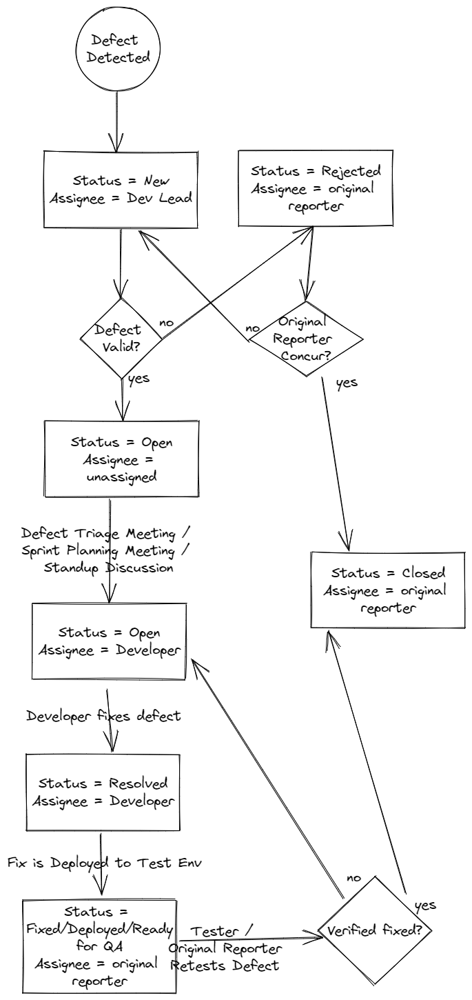

# Lesson: Defects

## Introduction

Defects (AKA Defect Reports, Bugs, Bug Reports) are opened whenever a test case fails or when ad-hoc testing is performed and an undesirable or questionable application behavior is observed. Defects are deviations from the expectations of the customer or user. Usually teams allow anyone on the team to open a defect, but it is typically Testers, Developers, and Business Analysts/System Analysts that open defects. Defect Tracking tools are almost always used, and most of the time these defect tracking tools are tightly integrated with the other project tracking tools used, such as requirement documentation, task or "story" cards, etc. There are both open source and commercial defect tracking tools.

## Learning Outcomes

When you've finished this lesson and its exercises, you should be able to:
* Describe the high-level components of a well-written defect reports
* Create defect reports with sufficient detail to accurately describe and reproduce the defect

Here is what a basic defect looks like:

```
ID
123

Title/Summary 
User Configuration System Menu option missing when searching from System Menu 

Description
Was unable to find the User Configuration System option when searching for "User Configuration"
This regression was introduced in 56.7.2 and was successfully working in 56.7.1

Steps to Reproduce
- Login as User
- Go to the System menu.
- Search for "User Configuration"

Expected Result
User Configuration System Menu option is displayed.

Actual Result
User Configuration System Menu option is not displayed.

Work-around
The user can click on the hamburger menu option and find the User Configuration System option there and it works as expected. 

Screenshot attached.
```

Usually meta-data about the defect is also captured, and can include for example:
- Environment Found
    - Test
    - Stage
    - Prod
- Date Found
- Date Fixed/Closed
- Code Version
- Linked Test Case / Test Run
- Root Cause
    - Requirement
    - Coding issue
    - Environment issue
    - Data issue
- Severity (Most companies have custom priority/severity guidelines to follow)
    - Critical
    - Major
    - Moderate
    - Minor
- Priority
    - High
    - Medium
    - Low

Defects follow a company or team-defined defect tracking flow. Usually something like this:



## Defect Tracking

Some Teams decide to not allow any code to be released when there are known defects. Other teams, depending on the severity of the defect, will allow the code to be released despite known defects. Some teams hold periodic Defect Tracking Meetings where some or all of the known existing defects will be discussed and either slotted for fixing in a future release, marked as "Closed Won't Fix" for various reasons, etc. Usually the Test Lead or QA Analyst on the team holds these meetings and invites key members of the team, including engineering leads, product / business owners, and project managers. Writing succinct, sufficiently detailed titles are especially helpful in these meetings. Information to include in Defect Tracking Meetings include Bug ID, Title, Status, Severity/Priority, Environment, Version Found, Version Fixed, Reported By, Assigned To, etc.

## Summary

Defects are deviations to 

This concludes the introduction to Manual Testing. Manual Testing is comprised of Test Planning, Test Case Creation and Execution and Defects. 

## Manual Testing and Defects Exercises

Please complete the following exercises
- [Manual Testing](../exercises/M15-exercise-manual-testing.md)