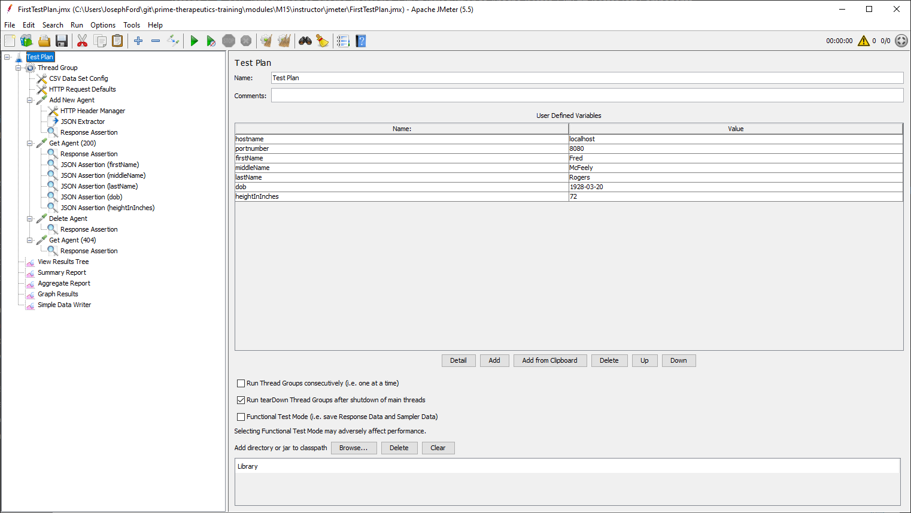
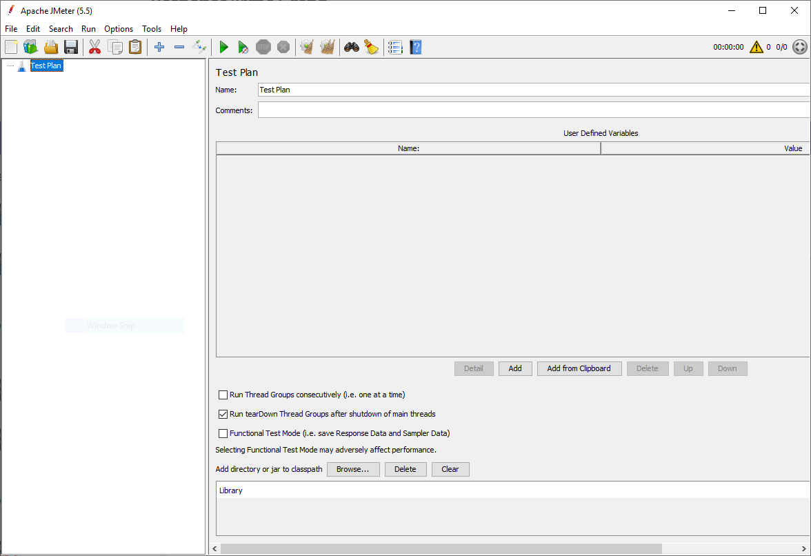

# Introduction to Apache JMeter

## About

Apache JMeter is a load testing tool. It has a Graphical User Interface (GUI) and can also run in a 'headless` or non-GUI mode (CLI mode). Apache JMeter was originally designed for Web Applications, but now supports many different services/protocols. It can run on a single machine or a single JMeter client can be configured to control multiple, remote JMeter engines. JMeter is 100% open-source and 100% pure Java.  

## JMeter Test Components

JMeter Test Plans are stylized as a Tree. Each component is executed in sequence, and each component is customized differently. 

When we're done, we should have something looking like this



JMeter has excellent documentation.
  - [User Manual](https://jmeter.apache.org/usermanual/index.html)
  - [Building a Test Plan](https://jmeter.apache.org/usermanual/build-test-plan.html)
  - [Test Script Recorder](https://jmeter.apache.org/usermanual/jmeter_proxy_step_by_step.html)

## Installation

Before doing any scripting, we have to install JMeter first. 

[Download the latest zip](https://jmeter.apache.org/download_jmeter.cgi) and extract to somewhere on your hard-drive. We will be opening it from the command line, so pick somewhere easy to navigate to (e.g. `C:\jmeter\`  or `C:\Users\<USERNAME>\jmeter` or `/Users/<USERNAME>/jmeter`). There is no other installation necessary other than unzipping.

## Launching JMeter

To start Apache JMeter, launch jmeter.bat in Windows or jmeter.sh on Mac/Linux. Regardless of how you open, **you must keep the Terminal window open otherwise JMeter will close**.

Windows:
```
C:\> cd ~\jmeter\bin
C:\Users\luser\jmeter\bin> .\jmeter.bat
```

You can also double-click the jmeter.bat using File Explorer.

Mac/Linux:
```
~/$ cd ~/jmeter/bin
~/jmeter/bin/$ ./jmeter.sh
```



## Un-installation

Un-installation is as simple as deleting the JMeter folder.

Windows:
```
C:\> rm -r -fo ~\jmeter
```

Mac/Linux:
```
~/$ rm -rf ./jmeter/
```

## Next
[Exercise - Performance Test Field Agent API](../exercises/M15-exercise-performance-testing.md)