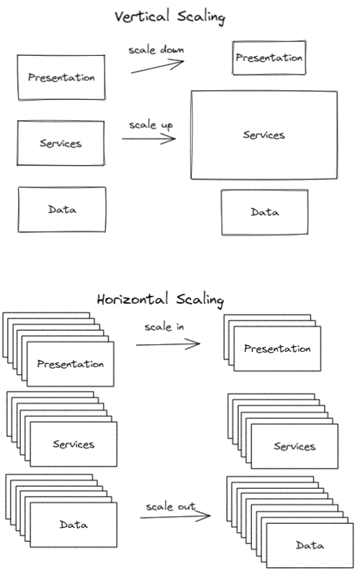

# Introduction to Performance Testing

Performance Testing is an umbrella term to describe all aspects of testing that include an application's ability to respond in a timely manner under all sorts of load scenarios. 

## Learning Outcomes

When you've finished this module you should have a high-level understanding of the following performance testing concepts
- Performance Testing Goals
- Performance Test Types
- Commercial and Open Source Performance Testing Tools/Technologies
- Introduction to Apache JMeter

We'll wrap up with an exercise using Apache JMeter to performance test the GET/POST/DELETE endpoints of the Field Agent WebService.

## Performance Testing Goals

The goals of performance testing very from project to project. It is important to first set performance testing goals by working with Operations, Engineering Management and the Product Owner. Some example goals:
- Execute load testing to demonstrate the system can handle 200 concurrent users
- Execute stress testing to determine at what point the system needs to be scaled out so that the operations team can pro-actively scale-out BEFORE those 

## Performance Test Types

There are many different terms used in Performance Testing, but they are not difficult concepts to understand, and they just help us in communicating with one another. 

- Load Testing
  - Under the expected load, do all users experience acceptable response times?
  - Ramp up to expected level and then hold
- Stress Testing
  - At what point does the system stop performing as expected when the load is larger than expected?
  - Ramp up slowly beyond expected levels
- Spike Testing
  - If an unusually large amount of traffic "spikes" can the system handle it? Can the system scale up to handle the traffic? How quickly does the scale up happen and is that short enough? Does it scale back down after the spike is gone?
  - Ramp up quickly beyond expected levels, ramp down quickly, etc.
- Endurance Testing
  - Similar to load testing, but for a very large amount of time. Some performance bugs only reveal themselves after the application has been "up" for a very large amount of [wall time](https://en.wikipedia.org/wiki/Elapsed_real_time). Other performance bugs reveal themselves only after a certain number of requests have been processed.
  - Ramp up to expected level and then hold for a long time.
- Scalability Testing
  - Vertical scaling (scale up / scale down) refers to adding more Memory, CPU, Disk to existing infrastructure. You can choose to scale up your physical layers (e.g. data, application, presentation) independently of each other. Vertical scaling is not usually performance tested, but it could be.
  - Horizontal scaling (scale out / scale in) refers to adding additional nodes to handle increased demand. Some software cannot be scaled horizontally and must run on a single node. For those systems which can be scaled horizontally, you can choose to scale out your physical layers independently. Horizontal scalability and the cloud go hand-in-hand. Instead of companies spending large amounts of money for very powerful servers to handle peak customer traffic, companies are switching to using extremely low cost horizontally-scalable solutions. Distributed Data Stores (e.g. NoSQL databases) need to take into account the [CAP Theorem](https://en.wikipedia.org/wiki/CAP_theorem). Scalability Testing measures how a system performs during scale-out and scale-in changes.

## Performance testing tools / technologies

There are many commercial offerings for Performance Testing. Again, most of these products integrate well with other enterprise level software. 
- [Silk Performer](https://en.wikipedia.org/wiki/Silk_Performer)
- [LoadRunner](https://en.wikipedia.org/wiki/LoadRunner)
- [Rational Performance Tester](https://en.wikipedia.org/wiki/IBM_Rational_Performance_Tester)
- [BlazeMeter](https://en.wikipedia.org/wiki/BlazeMeter)
- LoadUI/SoapUI (also referenced in [Testing Automation Tools](./M15-test-automation-tools.md))

There are also many open source Performance Test Automation tools, and again instead of complete all-in-one solutions, it is roll-your-own. 

## Performance Testing Process

## Summary

Lorem ipsum