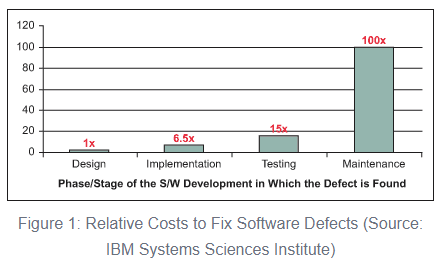

# Lesson: Introduction to Quality Engineering

## Goals of the Quality Engineering Module

Quality Engineering is an evolving, vast domain. In this module we will explore 3 main concepts
 - Test Management, Manual Testing and Defects
 - Automation Testing
 - Performance Testing

Over the next 3 days we will explore these quality topics by testing a 100% complete Field Agent. We will start with Manual Testing, then move to Automated Testing, and wrap up with Performance Testing. Each day will begin with a small amount of lecture, some reading, and then hands-on exercises.

## Lesson 1: Introduction to Quality Engineering

In this lesson, we will introduce many high level concepts used within the Quality and Software Engineering industries. 

## Learning Outcomes

When you've finished this lesson, you should be able to:
* Explain what defects are and why a focus on Quality can reduce the overall cost of developing software
* Articulate the differences between Quality Assurance, Quality Management, Quality Engineering
* Summarize 2 Software Development Methodologies and understand how Quality Engineering fits into both methodologies
  - Waterfall
  - Agile
* Understand different test levels (System Testing, Integration Testing, etc.)

## Defects

Defects are deviations from expected behavior. If the product is supposed to be red, but it's blue, that's a defect. If the email address is supposed to be validated for correctness, but there is no validation pop-up to the user when they enter an invalid email address, that is a defect. If the system is supposed to be able to respond within 25ms, but it responds in 35ms, that is a defect.

The way teams communicate the presence of defects is by opening a defect report. A defect report is simply a formal way of documenting that a defect exists, what the defect is all about, how to reproduce the defect, etc. Most companies will require that all defects be entered into a Defect Tracking Tool. There are many such tools, both commercial and open source and many of them integrate with other project and documentation management tools. In the next lesson we will explore defects in depth.

### Notable Software Defects
"Green Card" Lottery results voided
- [Second green card lottery held after first results voided](https://www.washingtonpost.com/local/second-green-card-lottery-to-be-held-today-after-first-results-voided/2011/07/11/gIQAdX3yFI_story.html)

- [Deputy Assistant Secretary Donahue Says 2012 Diversity Immigrant Visa Process Are Void](https://www.youtube.com/watch?v=E2-WZ8xUtXI)

Knight Capital Group loses $440,000,000 as a result of software defect
- [The Rise and Fall of Knight Capital — Buy High, Sell Low. Rinse and Repeat.](https://medium.com/dataseries/the-rise-and-fall-of-knight-capital-buy-high-sell-low-rinse-and-repeat-ae17fae780f6)

- [Case Study 4: The $440 Million Software Error at Knight Capital](https://www.henricodolfing.com/2019/06/project-failure-case-study-knight-capital.html)

Ariane flight V88 Launch Failure
- [The Worst Computer Bugs in History: The Ariane 5 Disaster](https://www.bugsnag.com/blog/bug-day-ariane-5-disaster)

### Cost of Defects

There are lots of studies and articles that show defects found early in the software development lifecycle cost less than defects found later in the software development lifecycle.
- [Defect Prevention: Reducing Costs and Enhancing Quality](https://www.isixsigma.com/tools-templates/software/defect-prevention-reducing-costs-and-enhancing-quality/)

## Quality Assurance vs Quality Management vs Quality Engineering

Quality Assurance (QA) specifically deals with testing and finding defects. QA is reactive. QA is the practice of testing software against documented requirements. It is the process of using a product and checking to see if it works as expected according to the documented requirements. 

If we think of soccer, defects are like goals scored against your team. And a professional sports team may spend a lot of money to hire a fantastic goalie to prevent goals. QA Professionals are like soccer goalies. They do what they can to prevent defects from being released into the wild.

QA is testing. Some QA concepts that we will dive into more include
- Test Plans
- Test Cases and Test Runs
  - Manual Testing
  - Automated Testing
- Defects / Bugs
- Requirements Traceability Matrices
- Testing Types
  - Functional Testing 
  - Regression Testing 
  - System Testing 
  - etc.

Quality Management (QM) is the practice of recommending policies and procedures with the goal of increasing overall product quality, not just reducing defects. QM recognizes that defects cost a lot of money if they were found during the testing cycle of a project and recommend changes to the development team's processes to increase product quality, which ultimately reduces the cost and the amount of defects.

Back to our soccer analogy, QM is like hiring an Assistant Coach with a defensive mindset. That Assistant Coach will coach not just the Goalie, but also the rest of the team. Perhaps they will recommend different formations that increase the teams defense. 

Some topics in QM include
- Quality "Consulting"
- Requirements Analysis
- Test Data Management
- Defect Root Cause Analysis

Quality Engineering (QE) builds on the practice of QM by getting everyone on the team involved, with everyone doing their part to ensure a quality product. QE is a blurring of the lines between QA/QM and Engineering. It is introducing testing earlier in the development lifecycle, and incorporating functional test automation into the build pipeline. It is an entire soccer team agreeing that "Offense Wins Games But Defense Wins Championships". Some of the topics in QE are:
- DevOps
- Automated Tests built into the process rather than as an after-thought
- Blending of roles between Quality Assurance Engineer and Software Development Engineer
- Continuous Integration / Continuous Delivery
- Code Coverage
- Static Code Analysis
- Pair Programming
- Code Reviews

## Software Development Methodologies

Teams don't just sit down and start writing software. They follow a process which includes requirements gathering, coding, testing, deploying, etc.. There are two major software development methodologies in use today. [Waterfall](https://en.wikipedia.org/wiki/Waterfall_model) and [Agile](https://en.wikipedia.org/wiki/Agile_software_development).

### Waterfall 

Waterfall projects follow a fairly strict, engineering based development model. The model consists of phases, and each phase is worked on in order. You don't proceed to the next phase until the previous phase is complete. The phases include:
- Requirements gathering
  - During this phase, all requirements are documented. All stake-holders/customers previously mentioned have input at this phase. Once requirements are finalized, they will be reviewed by a cross-functional team made up of developers, testers, business analysts, product owners, architects, other development teams, etc.
  - The project proceeds to the next phase once all the requirements have been documented and agreed to by all stake-holders
- Analysis and Design
  - During this phase, the architecture, operations and engineering teams will work on designing a system that will meet all the requirements. It is important to spend sufficient time in this phase so that (poor) early design decisions don't make a large impact later on during the coding / testing or deployment phases.
- Coding
  - During this phase the development team actually works on building the product. While the engineers are working on building the product, the test teams usually begin to write Test Plans and Test Cases
- Testing
  - During this phase the development team "hands it off" to the test team. 
  - The test team spends time executing their test plan and their test cases.
  - If defects are found, the developers will work on fixing the defects and then re-deploying the application for testing by the test team
  - Once all tests pass, or identified defects are "agreed as acceptable" by all stake-holders, then the project can proceed to the next phase 
- Deployment
  - In this phase the software is deployed to the end-users. 
  - Usually the "operations" team handles deploying the product and supporting the system once it is in "production"

Depending on the size of the project, this entire cycle can take from a couple of months to multiple years. Once the application is deployed to production, the cycle starts over again for the next version of the software. "Usually" deployments/upgrades happen between once and a handful of times a year.

### Agile

To help understand the Agile methodology, please take time to read the [Agile manifesto](https://agilemanifesto.org/) to understand why the Agile development model was created and what it is trying to solve. Please take the time to read the [Agile principles](https://agilemanifesto.org/principles.html) as well. There are multiple development models under the Agile umbrella: Extreme Programming (XP), Kanban, Scrum, and Lean. There is no "pure" agile development methodology.

If you want to learn more, there are tons of great articles about Agile. Here are some hand-picked articles that are great reading material:
- [Scrum vs Waterfall vs Agile vs Lean vs Kanban](https://www.visual-paradigm.com/scrum/scrum-vs-waterfall-vs-agile-vs-lean-vs-kanban/)
- [Agile Software Guide](https://martinfowler.com/agile.html)
- [The New Methodology](https://martinfowler.com/articles/newMethodology.html)

### Waterfall vs. Agile: "Throw it over the fence” vs. “Continuous Quality”

Testing a product that is developed using the Agile methodology has similarities and differences between testing in a Waterfall environment. You still create test cases based on the requirements, but the requirements are usually less well documented and can involve a lot of conversations back-and-forth between the product owners and the testers. Many teams believe a product feature is not complete until there are automated tests written to prove the new feature works as expected. Because of the shorter time frames between development complete and deployment to production, automated testing is an absolute necessity. The amount of repeated regression testing that occurs over the course of a year is substantially higher than in a Waterfall project.

Because a lot of projects are moving towards a more Agile development methodology, and because automated testing is so important for the success of an Agile project, companies are starting to blend the roles of QA and Development. This is the primary focus of Quality Engineering.  

## Test Strategies and Testing Levels (unit, integration, system, performance, etc.)

In order to help facilitate discussions among engineers, architects, testers and managers, there is a need to be able to clearly articulate different types of tests. Here we will introduce some of these terms and provide a loose definition of this concept. Please note that different organizations and different teams may use some of these terms differently. You can use this as a loose guide to help you understand these terms, but know that you may require clarification from your particular assignment.

### Test Strategies
Test Strategies (AKA Test Methods) can be applied to any Test Level below. At a high-level, there are two: Black Box and White Box. 

    - [Black Box testing](https://en.wikipedia.org/wiki/Black-box_testing) is testing where you put on your "end user" hat and only manipulate the input and verify the output. What happens behind the curtain is of no concern to you. Behind the scenes there may be [NoSQL databases](https://en.wikipedia.org/wiki/NoSQL), [Message Queues](https://en.wikipedia.org/wiki/Message_queue) and complicated [ETL](https://en.wikipedia.org/wiki/Extract,_transform,_load) processes, but none of that is your concern as a Black Box tester. All you care about is "If I do X, I better see Y happen"
    - [White Box testing](https://en.wikipedia.org/wiki/White-box_testing) is where you put your technical hat on and verify more than just what the end-user sees. Perhaps after clicking Submit, the system is supposed to put a message onto a queue which allows a downstream system to read those messages and updates a database. It's possible the User Interface is displaying all values to the end user correctly, but the message that is put onto the queue is malformed so the database isn't updated correctly as expected. Or maybe the front-end has validation that prevents you from exercising all the business logic that has been developed in the API. As a White Box tester, pretty much anything is fair game. You can manually manipulate the data in the database to see how the UI reacts with bad data. You could put test messages onto the message queue to see how the system responds when presented with missing or invalid data.

### Test Levels

[Test Levels](https://en.wikipedia.org/wiki/Software_testing#Testing_types,_techniques_and_tactics) (AKA Test Types) are different ways of grouping tests. They help to hold conversations with other people. "Hey, can you run a Smoke Test after I deploy this change to Production?", "We need to run our Regression Tests to make sure we didn't introduce any bugs into our existing features!". 

- [Functional Testing](https://en.wikipedia.org/wiki/Functional_testing)
  - Typically both white and black box
  - Functional testing is any type of testing which can easily be verified by simply using the software.
  - [Regression Testing](https://en.wikipedia.org/wiki/Regression_testing)
    - Regression Testing is an umbrella term to describe testing that validates that behavior that worked in previous releases continues to work as expected in future releases. For example, in Release 1, the product allowed the user to submit an event for scheduling a birthday party. In Release 2, the product allowed the user to submit an event for scheduling an office party. In Release 2, it is important to verify that the birthday party functionality that was released in Release 1 still functions as expected. Testing the birthday party functionality would be considered a Regression Test. If the birthday party functionality does not work, it is called a "regression".
  - [System Testing](https://en.wikipedia.org/wiki/System_testing)
    - System Testing usually means to test a system in isolation from other systems. For example, if the system that you are testing consists of an input queue, a rules processing engine, a database, and an output queue, you may perform all of your testing by putting messages onto the input queue, verify the data in the database and verify the output messages on the output queue.  As part of System Testing, you would not be responsible for testing the systems which put messages onto the input queue. You also would not be responsible for testing the system that takes messages off the output queue. 
  - [Integration Testing / System Integration Testing](https://en.wikipedia.org/wiki/Integration_testing)
    - Integration Testing is testing the integration of two or more components. It is a very generic term that can mean a lot of things. It could be testing the integration of the "Service" and the "Repository" together and could be part of the code's unit test suite. It could also mean testing how our product integrates with a 3rd party vendor's API. The term is very generic, and when discussing "integration testing" with other professionals, make sure you clearly understand what it is that is being "integration" tested.
  - [User Acceptance Testing](https://en.wikipedia.org/wiki/Acceptance_testing)
    - User Acceptance Testing (UAT) is conducted to ensure that the system can be used by the user for the intended purpose. 
    - If the system is for making airline reservations, then UAT would ensure that a user can actually use the system to make an airline reservation.
    - UAT is usually performed by a product owner or their team, but its goal is to ensure that the software meets all the expectations of the actual end-user. 
    - UAT is generally only black-box testing
  - [Smoke Testing](https://en.wikipedia.org/wiki/Smoke_testing_(software))
    - Smoke testing is a term used to describe a minimal set of validations that can/should occur for a "sanity check" that the software was deployed successfully and that there are no environmental issues.
    - Sometimes code works perfectly fine in a test environment, but once it is deployed to production, it doesn't work correctly because the data in the test environment was set up differently or perhaps there are firewalls in place in production that do not exist in the test environment.
    - Some example smoke tests include: 
      - Is the correct version of the code deployed?
      - Do the [Health Check APIs](https://www.ibm.com/garage/method/practices/manage/health-check-apis/) all pass?
      - Can users log in / submit a record / log out?
  - [Exploratory/Ad-hoc Testing](https://www.atlassian.com/continuous-delivery/software-testing/exploratory-testing)
    - Exploratory testing is the process of using the software without a set of predetermined steps and trying to uncover hard to find defects.
    - Most "Testing" is intentionally well-documented, to provide proof as to what has been verified as working, what has not yet been verified as working, and what has been identified as not working.
    - Exploratory Testing is different from other types of testing in that it really cannot be documented well. The whole purpose of exploratory testing it is to allow the creativity and free thinking of the exploratory tester to find defects. It is difficult to document all the tests that were performed by the tester. However, if any defects were found, the steps to reproduce that defect should be documented as a target for future testing.
  - [Performance Testing](https://en.wikipedia.org/wiki/Software_performance_testing)
    - Performance Testing is an umbrella term to describe all aspects of testing that include an application's ability to respond in a timely manner under all sorts of load scenarios.
    - Load Testing
      - Under the expected load, do all users experience acceptable response times?
      - Ramp up to expected level and then hold
    - Stress Testing
      - At what point does the system stop performing as expected when the load is larger than expected?
      - Ramp up slowly beyond expected levels
    - Spike Testing
      - If an unusually large amount of traffic "spikes" can the system handle it? Can the system scale up to handle the traffic? How quickly does the scale up happen and is that short enough? Does it scale back down after the spike is gone?
      - Ramp up quickly beyond expected levels, ramp down quickly, etc.
    - Endurance Testing
      - Similar to load testing, but for a very large amount of time. Some performance bugs only reveal themselves after the application has been "up" for a very large amount of [wall time](https://en.wikipedia.org/wiki/Elapsed_real_time). Other performance bugs reveal themselves only after a certain number of requests have been processed.

## Summary

Quality Assurance is testing and finding defects, Quality Management is recommending practices to improve quality, and Quality Engineering is the evolving practice of writing high quality software where everyone gets involved. Software testing can take many forms and can be very high-level or extremely technical. Software testing focuses on functionality, useability and performance to ensure high quality software for our end users.