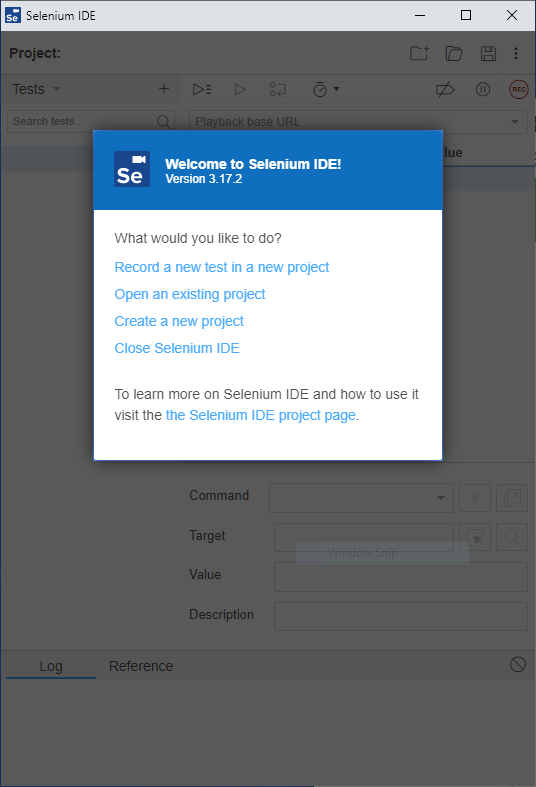
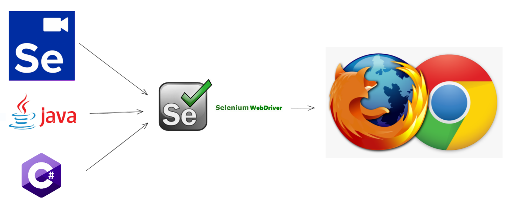

## Introduction

Selenium is an open source project to help with automating web browsers. Selenium has a few different tools that can help with web browser automation:
 - Selenium IDE
 - Selenium WebDriver
 - Selenium Client and WebDriver Language Bindings
 - Selenium Grid

## Learning Outcomes

When you've finished this lesson and its exercises, you should be understand the different Selenium components and how to use them to automate your manual test cases.

## Selenium IDE

[Selenium IDE](https://www.selenium.dev/selenium-ide/) is a browser extension for Chrome and Firefox. It allows you to Record and Playback automation tests. You can create many Test Plans with each Test Plan containing many Test Cases. Each Test Case can interact with a web page and verify content of HTML elements.

## Selenium WebDriver

[Selenium WebDriver](https://www.selenium.dev/documentation/webdriver/) is an executable that allows your Java code to open Chrome or Firefox and automate browser activity. In combination with the language bindings (below), it allows you to take your automation code out of Selenium IDE and into the programming language of your choice. 

## Selenium Client and WebDriver Language Bindings
[Selenium Client and WebDriver Language Bindings](https://www.selenium.dev/documentation/webdriver/getting_started/install_library/) are libraries (JARs) which provide the API for Selenium for Java, C#, Ruby, etc. They allow you to write code in your choice of language which will interact with Selenium WebDriver, which will in turn open your browser, click links, fill and submit forms, read text, etc.

We will be using Maven to import the libraries, but you can also download them from the [Selenium downloads page](https://www.selenium.dev/downloads/).

## Selenium Grid

[Selenium Grid](https://www.selenium.dev/documentation/grid/) makes it possible to run the tests you develop on more than one machine. It allows you to execute your tests in parallel if you have multiple machines. It allows you to run your tests on different OSs, different browsers, etc. We will not be using Selenium Grid as part of this module.

## Review Page Object Model

Take some time to read the Page Object Model on the Selenium Website.
  - [Page Object Models](https://www.selenium.dev/documentation/test_practices/encouraged/page_object_models/)

Also read the Dos and Don'ts:
  - [Encouraged behaviors](https://www.selenium.dev/documentation/test_practices/encouraged/)
  - [Discouraged behaviors](https://www.selenium.dev/documentation/test_practices/discouraged/)

## Summary

Selenium is an open source project with many downloadable components that can help automate web browsers. You can choose which components are necessary for your project. Selenium integrates nicely with Java and many other programming languages.

## Next
[Automated Testing with Selenium](./exercises/M15-exercise-automated-testing.md)